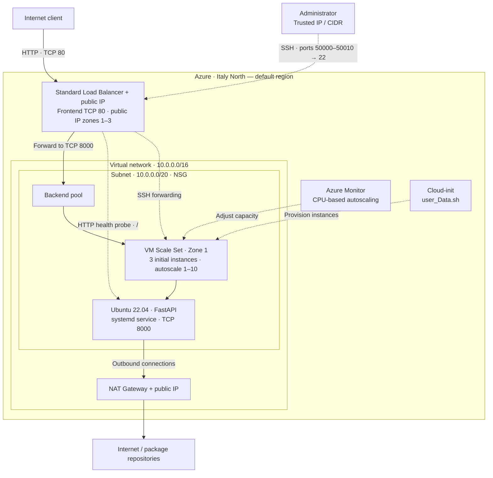

# Azure VMSS Networking Lab

An Azure networking lab built with Terraform: private VM Scale Set instances behind a public Load Balancer, with CPU autoscaling, NAT Gateway egress and automated Linux provisioning.

**Technologies:** Azure · Terraform · Virtual Machine Scale Sets · Load Balancer · NAT Gateway · Network Security Groups · Cloud-init · FastAPI

## Why I built this

I built this lab to understand how requests reach private compute instances, how health probes affect traffic routing, and how outbound connectivity and autoscaling fit together. A small FastAPI application returns the hostname of the instance serving each request, keeping the focus on networking and systems architecture.

## Start here

- [Networking](main.tf) — VNet, subnet NSG, Load Balancer, SSH forwarding and NAT Gateway.
- [Compute and autoscaling](VM-Scale-Set.tf) — VMSS provisioning, capacity rules and infrastructure dependencies.
- [Application bootstrap](user_Data.sh) — FastAPI installation and its non-root systemd service.
- [Architecture notes](docs/architecture.md) — traffic paths, security boundaries and availability trade-offs.

## Architecture



The diagram shows logical paths using the default region and network ranges. Solid arrows show application and outbound traffic; dotted arrows show health probes, SSH, provisioning and scaling.

## Key design decisions

- VMSS instances have private addresses and receive application traffic through the Load Balancer.
- The public frontend listens on port 80 while the non-root FastAPI service listens on backend port 8000.
- Health probes request `/` on port 8000 and keep unhealthy instances out of rotation.
- `custom_data` passes the bootstrap script to cloud-init. VMSS provisioning waits for the subnet NSG, NAT subnet association and NAT public-IP association.
- FastAPI runs as `azureuser` under `systemd`, with restart and boot startup enabled. FastAPI and Uvicorn versions are pinned; package downloads use bounded retries.
- Load Balancer outbound SNAT is disabled because the subnet uses a NAT Gateway.
- Terraform ignores later changes to VMSS capacity so Azure Monitor can manage autoscaling without configuration drift.

## Prerequisites

- An Azure subscription with permission to create compute, networking, and monitoring resources
- Azure CLI authenticated to the intended subscription
- Terraform 1.5 or newer
- An OpenSSH public key
- Your trusted public IP address expressed as a CIDR, normally `<your-ip>/32`
- Availability of `Standard_B1s` and the configured zones in the selected Azure region

## Deploy

Create an SSH key if you do not already have one:

```bash
mkdir -p .ssh
ssh-keygen -t rsa -b 4096 -f .ssh/id_rsa -N ""
```

Create a local variables file, then replace both documentation-only values:

```bash
cp terraform.tfvars.example terraform.tfvars
```

```hcl
admin_source_cidr = "<your-public-ip>/32"
ssh_public_key    = "<contents-of-your-public-key>"
```

Authenticate and review the deployment before creating resources:

```bash
az login
az account set --subscription "<subscription-id-or-name>"

terraform init
terraform fmt -check
terraform validate
terraform plan -out=tfplan
terraform apply tfplan
```

Applying this project creates billable Azure resources. Always review the plan first.

## Verify

Retrieve and test the generated application URL:

```bash
terraform output -raw application_url
curl "$(terraform output -raw application_url)"
```

Each response identifies the VMSS instance that handled it:

```json
{
  "status": "ok",
  "message": "Azure VMSS networking lab",
  "server_instance": "<vm-hostname>"
}
```

Repeated requests may show different hostnames as the Load Balancer distributes traffic.

## Autoscaling behavior

| Condition | Action |
| --- | --- |
| Average CPU above 80% for 5 minutes | Add one instance |
| Average CPU below 10% for 5 minutes | Remove one instance |
| Capacity boundaries | Minimum 1, default 3, maximum 10 |
| Cooldown after either action | 1 minute |

## Security choices

- Password authentication is disabled on every VMSS instance.
- Public SSH access is restricted to `admin_source_cidr`; use a `/32` for one public IPv4 address.
- Backend instances do not receive individual public IP addresses.
- HTTP client traffic and Azure Load Balancer health probes use separate NSG rules.
- VM user data contains no credentials or application secrets.
- Terraform variable files, state files, plans, environment files, and private keys are ignored by Git.

## Design scope

This is a focused learning project rather than a production platform:

- Compute instances are currently pinned to Availability Zone 1, so the workload is not resilient to a full zone outage.
- Autoscaling may reduce capacity to one instance, which removes instance redundancy at low load.
- The application uses HTTP without TLS termination.
- Terraform state is local rather than stored in a protected remote backend.
- Centralized logging, boot diagnostics and automated deployment are not included.

## Cleanup

Remove the lab when it is no longer needed:

```bash
terraform destroy
```
