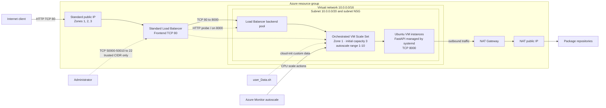

# Azure VMSS Networking Lab

Terraform-based Azure infrastructure lab exploring how networking, load balancing, autoscaling, and virtual machine provisioning work together in a scalable web architecture.

**Technologies:** Azure · Terraform · Virtual Machine Scale Sets · Load Balancer · NAT Gateway · Network Security Groups · Cloud-init · FastAPI

## Why I built this

I built this project to move beyond deploying a single virtual machine and understand how Azure infrastructure components form a complete system. The focus was learning how requests reach private compute instances, how unhealthy instances leave Load Balancer rotation, how outbound traffic is controlled, and how capacity changes automatically with demand.

The application is intentionally small. The main learning outcome is the infrastructure and the reasoning behind its network paths, security boundaries, and availability trade-offs.

## What this project demonstrates

- Infrastructure as Code with reusable Terraform variables and outputs
- Public-to-private request routing through Azure Load Balancer
- VM Scale Set integration with a backend pool and health probe
- CPU-based horizontal autoscaling between 1 and 10 instances
- Subnet-level traffic control with a Network Security Group
- Controlled outbound connectivity through Azure NAT Gateway
- Automated Linux provisioning with cloud-init and `systemd`
- SSH access restricted to an explicitly trusted administrator CIDR
- Awareness of the difference between instance redundancy and zone resilience

## Architecture



The Load Balancer accepts HTTP on port 80 and forwards requests to FastAPI on port 8000. Azure Monitor adjusts VMSS capacity from CPU metrics, while the NAT Gateway provides a dedicated outbound path for the private instances.

See [docs/architecture.md](docs/architecture.md) for the complete diagram, traffic paths, security boundaries, and availability model.

## Azure resources

| Resource | Responsibility |
| --- | --- |
| Resource Group | Contains the lab resources |
| Virtual Network and Subnet | Provide private addressing for VMSS instances |
| Network Security Group | Allows HTTP, health probes, and restricted SSH traffic |
| Standard Public IP | Provides the public Load Balancer address and FQDN |
| Standard Load Balancer | Distributes requests and probes backend health |
| Virtual Machine Scale Set | Runs the FastAPI service across elastic Ubuntu instances |
| Azure Monitor Autoscale | Adds or removes instances from CPU thresholds |
| NAT Gateway | Provides predictable outbound internet connectivity |

## Key design decisions

- VMSS instances have private addresses and receive application traffic through the Load Balancer.
- The public frontend listens on port 80 while the non-root FastAPI service listens on backend port 8000.
- Health probes request `/` on port 8000 and keep unhealthy instances out of rotation.
- `custom_data` passes the bootstrap script to cloud-init during provisioning.
- FastAPI runs as the `azureuser` account under `systemd` and restarts after failures or reboots.
- Load Balancer outbound SNAT is disabled because the subnet uses a NAT Gateway.
- Terraform ignores later changes to VMSS capacity so Azure Monitor can manage autoscaling without configuration drift.

## Prerequisites

- An Azure subscription with permission to create compute, networking, and monitoring resources
- Azure CLI authenticated to the intended subscription
- Terraform 1.5 or newer
- An OpenSSH public key
- Your trusted public IP address expressed as a CIDR, normally `<your-ip>/32`
- Availability of `Standard_B1s` and the configured zones in the selected Azure region

## Deploy

Create an SSH key if you do not already have one:

```bash
mkdir -p .ssh
ssh-keygen -t rsa -b 4096 -f .ssh/id_rsa -N ""
```

Create a local variables file, then replace both documentation-only values:

```bash
cp terraform.tfvars.example terraform.tfvars
```

```hcl
admin_source_cidr = "<your-public-ip>/32"
ssh_public_key    = "<contents-of-your-public-key>"
```

Authenticate and review the deployment before creating resources:

```bash
az login
az account set --subscription "<subscription-id-or-name>"

terraform init
terraform fmt -check
terraform validate
terraform plan -out=tfplan
terraform apply tfplan
```

Applying this project creates billable Azure resources. Always review the plan first.

## Verify

Retrieve and test the generated application URL:

```bash
terraform output -raw application_url
curl "$(terraform output -raw application_url)"
```

Each response identifies the VMSS instance that handled it:

```json
{
  "status": "ok",
  "message": "Azure VMSS networking lab",
  "server_instance": "<vm-hostname>"
}
```

Repeated requests may show different hostnames as the Load Balancer distributes traffic.

## Autoscaling behavior

| Condition | Action |
| --- | --- |
| Average CPU above 80% for 5 minutes | Add one instance |
| Average CPU below 10% for 5 minutes | Remove one instance |
| Capacity boundaries | Minimum 1, default 3, maximum 10 |

## Security choices

- Password authentication is disabled on every VMSS instance.
- SSH is permitted only from `admin_source_cidr`; a `/32` limits access to one public IPv4 address.
- Backend instances do not receive individual public IP addresses.
- HTTP client traffic and Azure Load Balancer health probes use separate NSG rules.
- VM user data contains no credentials or application secrets.
- Terraform variable files, state files, plans, environment files, and private keys are ignored by Git.

## Design scope

This is a focused learning project rather than a production platform:

- Compute instances are currently pinned to Availability Zone 1, so the workload is not resilient to a full zone outage.
- Autoscaling may reduce capacity to one instance, which removes instance redundancy at low load.
- The application uses HTTP without TLS termination.
- Terraform state is local rather than stored in a protected remote backend.
- Centralized logging, boot diagnostics, automated tests, and CI deployment are not included.

These boundaries keep the project small while leaving clear next steps for multi-zone resilience, observability, TLS, remote state, and continuous validation.

## Cleanup

Remove the lab when it is no longer needed:

```bash
terraform destroy
```
