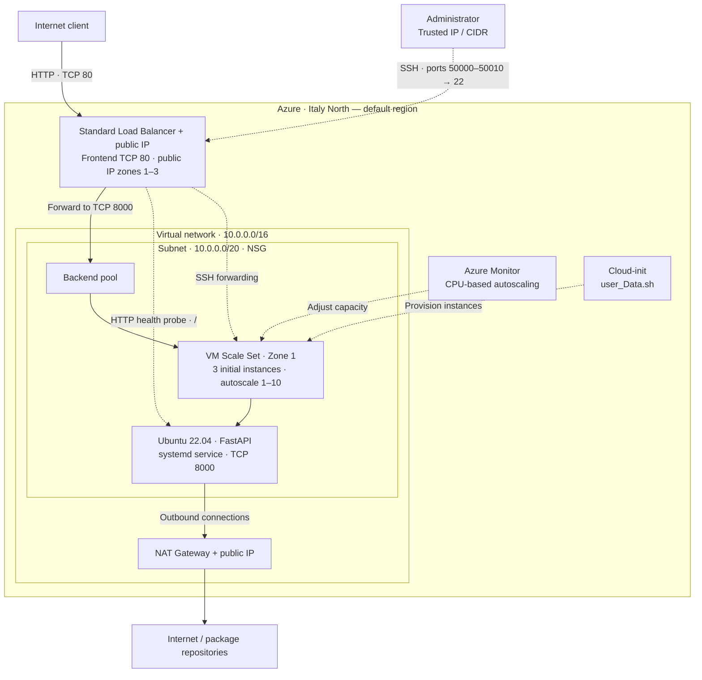

# Architecture

This project models a small Azure web tier designed to explore networking and systems architecture. Terraform connects a public Load Balancer to private VM Scale Set instances, adds health-aware routing and autoscaling, and gives the subnet a dedicated outbound path.

## Diagram

The diagram shows logical paths using the default region and network ranges. Solid arrows show application and outbound traffic. Dotted arrows show health probes, SSH, provisioning and scaling.

## Request and control flows

| Flow | Behavior |
| --- | --- |
| Public HTTP | The Standard public IP receives TCP 80 traffic. The Load Balancer forwards it to backend port 8000 on healthy VMSS instances. |
| Health probe | The Load Balancer requests `/` over HTTP on port 8000. An unhealthy probe status stops new flows to that instance. |
| Provisioning | Terraform supplies `user_Data.sh` as base64-encoded custom data. Cloud-init installs the application and enables its `systemd` service. |
| Autoscaling | Azure Monitor adds one instance above 80% average CPU and removes one below 10%, using five-minute evaluation windows and a one-minute cooldown after each action. |
| Outbound access | VMSS instances use the subnet-associated NAT Gateway for package installation and other internet egress. |
| SSH | The Load Balancer maps frontend ports 50000-50010 to backend port 22. The NSG restricts the source to `admin_source_cidr`. |

## Security boundaries

- The subnet NSG applies to every VMSS network interface.
- Public application traffic reaches TCP 8000 through the Load Balancer; a separate inbound NAT rule provides SSH access.
- Azure Load Balancer probe traffic has a separate NSG rule.
- SSH password authentication is disabled, and the network path is restricted to a caller-supplied administrator CIDR.
- VMSS instances have no individual public IP addresses.
- Outbound traffic uses the NAT Gateway rather than Load Balancer SNAT.
- Default NSG rules still allow virtual-network traffic and outbound internet access; NAT Gateway provides an outbound address, not destination filtering.
- The bootstrap data contains no credentials or secrets.

## Availability model

- The Load Balancer frontend public IP declares Zones 1, 2, and 3.
- The VMSS begins with three instances and uses max fault-domain spreading within Zone 1.
- The health probe prevents an unhealthy application instance from receiving new requests.
- CPU autoscaling adjusts capacity between 1 and 10 instances.
- All compute remains in Zone 1, and the minimum capacity is one. This design demonstrates instance-level availability and elastic capacity but does not provide availability-zone resilience.

## Production considerations

A production evolution could spread compute across multiple availability zones, keep at least two instances, terminate TLS through an appropriate ingress service, store Terraform state remotely, and add centralized telemetry. The current CI workflow performs static validation; it does not plan or deploy Azure resources.
